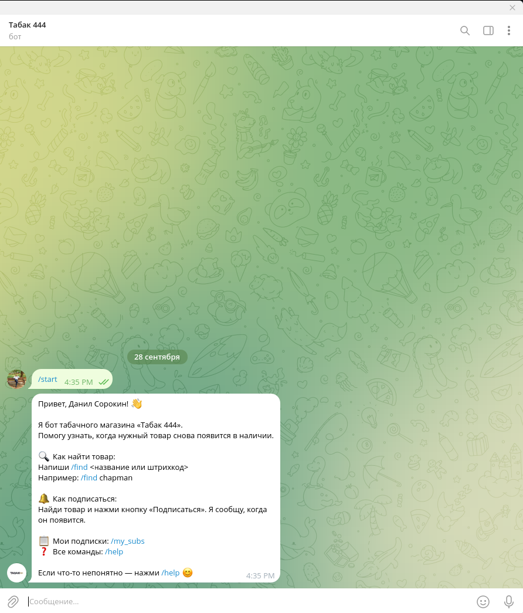
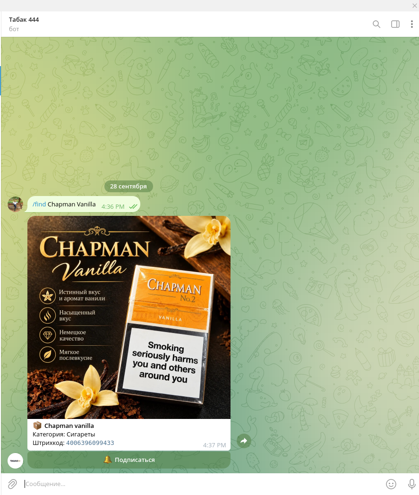
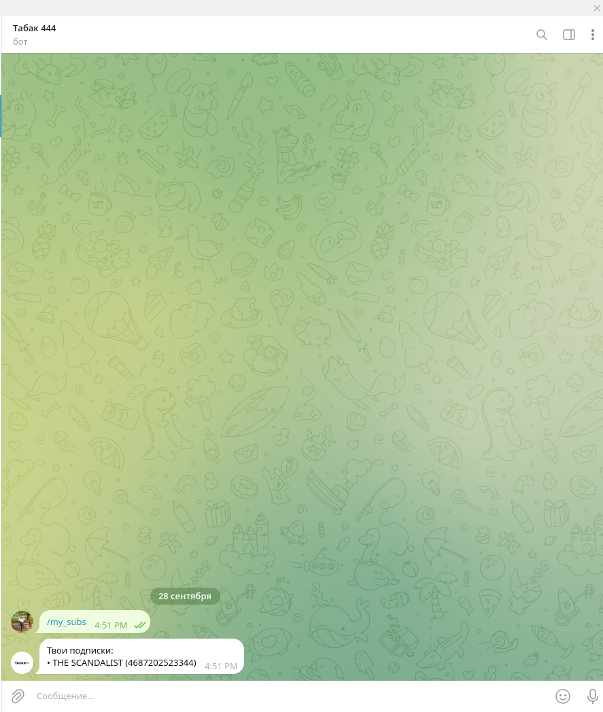

# 🚬 Табак 444 — Telegram-бот табачного магазина

Telegram-бот для автоматизации уведомлений клиентов о поступлении товара. Работает в связке с USB-сканером штрихкодов: когда товар появляется в магазине, бот автоматически рассылает уведомления подписчикам.

## 🎯 Возможности

### Для клиентов
- 🔍 **Поиск товаров** — по штрихкоду или названию (`/find`)
- 📦 **Список всех товаров** — с кнопками подписки (`/all`)
- 📂 **Категории** — список категорий и товары в них (`/categories`, `/category`)
- 🖼 **Фото товаров** — карточки с изображениями
- 🔔 **Подписки** — клиент подписывается на товар и получает уведомление, когда он появляется
- 📋 **Мои подписки** — список активных подписок (`/my_subs`)
- 🔕 **Отписка** — через команду или inline-кнопку
- ⚡ **Автоматические уведомления** — при сканировании товара сканером

### Для админа
- 🔧 **Админ-панель** — `/admin`
- ➕ **Добавление товара** — `/add_product` (пошаговый диалог с фото)
- 🗑 **Удаление товара** — `/delete_product`
- 📊 **Статистика** — `/stats` (товары, подписки, топ-5)
- 📢 **Рассылка** — `/broadcast` (всем подписчикам)

## 🏗 Архитектура

```
[USB-сканер] → [test_evdev.py] → POST /notify → [FastAPI] → [aiogram] → [Telegram]
                                                                    ↓
                                                              [SQLite]
```

**Три компонента:**
1. **`app.py`** — FastAPI + Telegram-бот (aiogram) в одном процессе.
2. **`test_evdev.py`** — скрипт сканера (evdev), отправляет POST-запросы в API.
3. **`database.py` + `models.py`** — SQLAlchemy + SQLite.

## 🛠 Стек технологий

- **Python 3.14**
- **FastAPI** — REST API для приёма сигналов от сканера
- **aiogram 3.x** — асинхронный Telegram-бот
- **SQLAlchemy** — ORM для работы с базой
- **SQLite** — база данных
- **httpx** — HTTP-клиент для сканера
- **evdev** — чтение событий сканера напрямую из `/dev/input/`
- **uvicorn** — ASGI-сервер
- **Docker** — контейнеризация

## 🚀 Установка и запуск

### Вариант 1: Локальный запуск

#### 1. Клонировать репозиторий

```bash
git clone https://github.com/DanilSorokin2004/tobacco444_bot.git
cd tobacco444_bot
```

#### 2. Создать виртуальное окружение

```bash
python -m venv .venv
source .venv/bin/activate  # Linux
# .venv\Scripts\activate   # Windows
```

#### 3. Установить зависимости

```bash
pip install fastapi uvicorn httpx aiogram python-dotenv sqlalchemy aiohttp-socks evdev
```

#### 4. Создать `.env`

```
BOT_TOKEN=ваш_токен_от_BotFather
ADMIN_ID=ваш_telegram_id
```

#### 5. Инициализировать базу данных

```bash
python init_db.py
```

#### 6. Запустить API + бота

```bash
python app.py
```

#### 7. Запустить сканер (в отдельном терминале)

```bash
sudo .venv/bin/python test_evdev.py
```

### Вариант 2: Запуск через Docker

#### 1. Установить Docker

```bash
sudo dnf install docker-ce docker-ce-cli containerd.io docker-buildx-plugin docker-compose-plugin
```

#### 2. Настроить прокси для Docker (если Docker Hub заблокирован)

```bash
sudo mkdir -p /etc/systemd/system/docker.service.d
sudo tee /etc/systemd/system/docker.service.d/http-proxy.conf > /dev/null << 'EOF'
[Service]
Environment="HTTP_PROXY=http://127.0.0.1:10808"
Environment="HTTPS_PROXY=http://127.0.0.1:10808"
Environment="NO_PROXY=localhost,127.0.0.1"
EOF

sudo systemctl daemon-reload
sudo systemctl restart docker
```

#### 3. Создать `.env`

```
BOT_TOKEN=ваш_токен
ADMIN_ID=ваш_id
```

#### 4. Запустить

```bash
docker compose up -d --build
```

#### 5. Проверить

```bash
docker compose ps
docker compose logs -f
curl http://127.0.0.1:8000/health
```

#### 6. Остановить

```bash
docker compose down
```

## 📖 Использование

### Команды бота (для клиентов)

| Команда | Описание |
|---|---|
| `/start` | Приветствие и список команд |
| `/help` | Подробная справка |
| `/find <штрихкод или название>` | Найти товар |
| `/all` | Все товары с кнопками подписки |
| `/categories` | Список категорий |
| `/category <название>` | Товары в категории |
| `/subscribe <штрихкод>` | Подписаться на товар |
| `/my_subs` | Мои подписки |
| `/unsubscribe <штрихкод>` | Отписаться |

### Команды бота (для админа)

| Команда | Описание |
|---|---|
| `/admin` | Админ-панель |
| `/add_product` | Добавить товар |
| `/delete_product` | Удалить товар |
| `/stats` | Статистика |
| `/broadcast` | Рассылка подписчикам |

### API

| Метод | Endpoint | Описание |
|---|---|---|
| `GET` | `/health` | Проверка работоспособности |
| `POST` | `/notify` | Отправить уведомление подписчикам |

**Пример:**

```bash
curl -X POST http://127.0.0.1:8000/notify \
  -H "Content-Type: application/json" \
  -d '{"barcode":"4006396099433"}'
```

## 📸 Скриншоты

### Приветствие бота


### Поиск товара


### Мои подписки


## 📄 Лицензия

MIT License — см. файл [LICENSE](LICENSE)

## 👤 Автор

**Данил Сорокин**
- GitHub: [@DanilSorokin2004](https://github.com/DanilSorokin2004)
